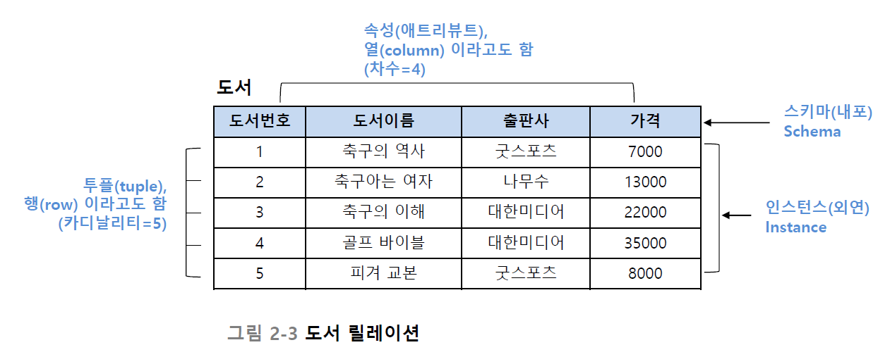
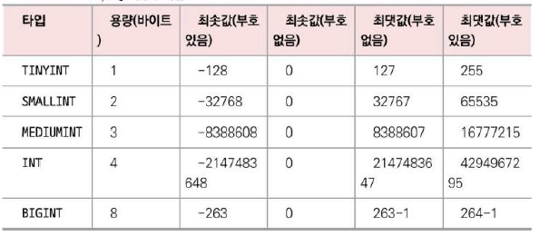
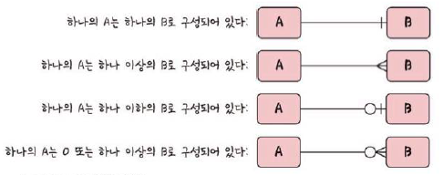
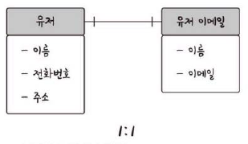
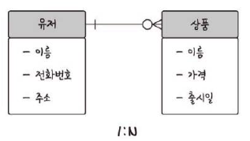
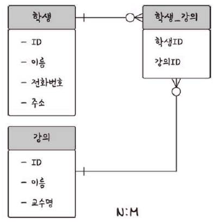
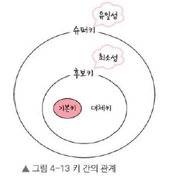

## 1. 데이터베이스의 기본

### **4.1.1~5. 엔티티, 릴레이션, 속성, 도메인, 필드와 레코드**

- 엔티티: 사람, 장소, 물건, 사건, 개념 등 여러 개의 속성을 지닌 명사
    - ‘책’이라는 엔티티
    - 강한 엔티티와 약한 엔티티
        - 강한 엔티티: 고유 식별자(Primary Key)를 갖고 있음. 각 튜플은 자체의 속성을 통해 고유하게 식별된다.
        - 약한 엔티티: 고유 식별자를 가지지 않는 엔티티. 부모 엔티티와의 관계와 부모 엔티티의 키를 사용하여 구분. 부모 엔티티에 종속적이다.
        - 상품 정보와 주문 정보가 있을 때 상품 정보는 고유하게 식별 가능하다. 한편 주문 정보는 상품 정보에 종속적인 약한 엔티티이다.
- 릴레이션: DB에서 정보를 구분하여 저장하는 기본 단위. 하나의 엔터티를 하나의 릴레이션으로 만들어 관리
    - ‘도서’라는 릴레이션
- 속성: 릴레이션에서 관리하는 구체적이며 고유한 이름을 갖는 정보
    - ‘도서번호’, ‘도서이름’, ‘출판사’, ‘가격’이라는 속성
- 도메인: 속성값으로 가능한 모든 값의 집합
    - ‘성별’이라는 속성의 도메인은 { 남, 여 }
- 필드: 테이블에서 세로축
    - 필드 타입
        - 숫자 타입
            
        - 날짜 타입
            - DATE: `1000-01-01` ~ `9999-12-31`
            - DATETIME: `1000-01-01 00:00:00` ~ `9999-12-31 23:59:59` 8바이트
            - TIMESTAMP: `1970-01-01 00:00:01` ~ `2038-01-19 03:14:07` 4 바이트
            - CHAR/VARCHAR: `CHAR`는 고정길이, `VARCHAR`는 가변길이 (0~65535의 길이)
            - TEXT/BLOB: 큰 데이터 저장할 때 사용. `TEXT`는 문자열. 보통 게시판의 본문 저장할 때 사용. `BLOB`는 이미지 동영상 등 저장할 때 사용
            - ENUM/SET: 문자열 열거형
- 레코드: 테이블에서 가로축

### **4.1.6. 관계**

- DB에 테이블은 여러 개이고, 각 테이블들은 서로의 관계가 함께 정의돼 있다. 이러한 관계를 관계화살표로 나타낸다.

- **1:1 관계**
    
    
- **1:N 관계**
    
    
    
- **N:M 관계**
    
    
    
    - N:M 관계는 직접 연결하지 않고 1:N, 1:M 관계를 갖는 테이블 두 개로 나눠 설정한다.

### **4.1.7. 키**

- 기본키 (Primary Key)
    - 자연키: 중복된 (사용 불가능한) 값들을 제외해나갈 때 자연스럽게 남는 키
    - 인조키: 인위적으로 만든, 변하지 않는 키
- 외래키 (Foreign Key): 약한 엔티티가 강한 엔티티의 기본키를 참조했을 때의 키
    - 주문 정보에서 상품의 기본키
- 후보키 (Candidate Key): 기본키가 될 수 있는 후보
- 대체키 (Alternate Key): 후보키가 두 개 이상일 경우 어느 하나를 기본키로 지정하고 남은 후보키
- 슈퍼키 (Super Key): 각 레코드를 유일하게 식별할 수 있는 유일성을 갖춘 키