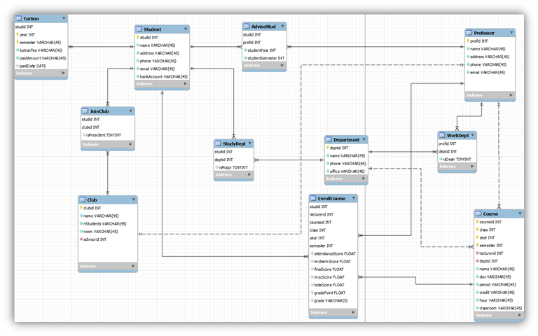
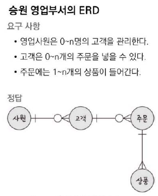
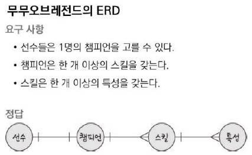
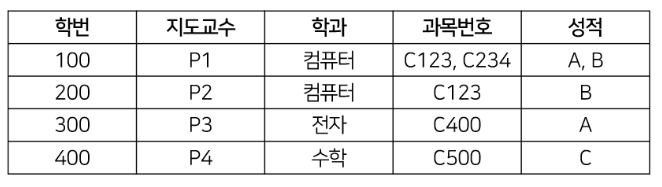
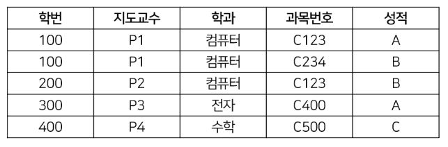
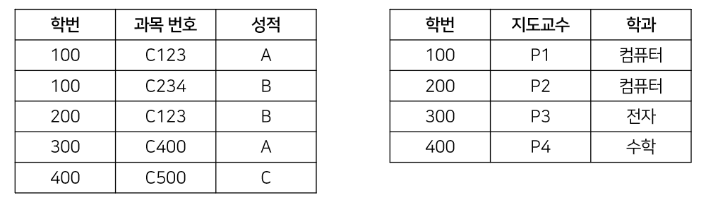
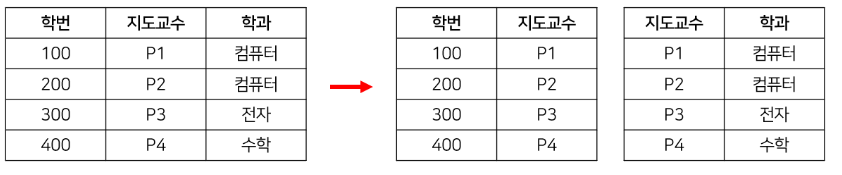
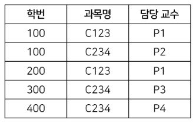
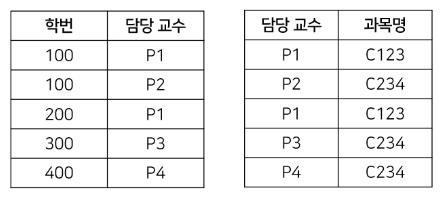

## 2. ERD와 정규화 과정

ERD(Entity Relationship Diagram) DB를 구축할 때 가장 기초적인 뼈대 역할. 릴레이션 간의 관계들을 정의한 

### 1. ERD의 중요성

시스템의 요구 사항을 기반으로 ERD를 만들고, ERD를 기반으로 데이터베이스를 구축하기 때문이다.

(비정형 데이터는 표현하지 못한다는 단점이 있다.)

### 2. 예제로 배우는 ERD

### 3. 정규화 과정

릴레이션 간의 잘못된 종속 관계로 인해 데이터베이스 이상 현상이 일어나서 이를 해결하거나 저장 공간을 효율적으로 사용하기 위해 릴레이션을 여러 개로 분리하는 과정

정규화 과정 = '정규형 원칙'을 기반으로 정규화해 나간다.

- 정규형 원칙: 같은 의미를 표현하는 릴레이션이더라도 더 좋은 구조를 가져야 하고, 자료의 중복성은 감소해야 하며, 독립적인 관계는 별개의 릴레이션으로 표현해야 하며 각각의 릴레이션은 독립적인 표현이 가능해야 한다.
- **제1정규형을 만족하지 못하는 릴레이션**
    
    
    
    - 학번이 100인 학생의 과목번호와 성적이 두 개씩 들어가있으므로 제1정규형을 만족시키지 못한다.
- **1NF (제1정규형)**
    - 릴레이션의 모든 도메인이 더 이상 분해 불가능한 원자값만으로 구성돼야 한다.
    
    
    
    - 하지만 위의 릴레이션에서는 ‘성적’ 속성은 기본키인 { ’학번’, ‘과목번호 }에 완전히 종속되지만, ‘지도교수’와 ‘학과’ 속성은 기본키 중 ‘학번’ 속성에만 종속되므로 **기본키가 아닌 속성들이 기본키에 완전 함수 종속되지 못하고 부분 함수 종속된다**고 말하며, 제2정규형을 만족시키지 못한다.
- **2NF (제2정규형)**
    - 제1정규형이면서 기본키에 속하지 않는 모든 속성이 기본키에 **완전 함수 종속**이어야 한다.
    
    
    
    - 위의 릴레이션에는 '학번' → '지도교수', '지도교수' → '학과', '학번' → '학과'의 종속성이 존재한다. '학과' 속성이 '학번' 속성에 **이행적으로 종속되었다**고 말한다.
- **3NF (제3정규형)**
    - 제2정규형이면서 **이행적 함수 종속성**이 없어야 한다.
    
    
    
- **BCNF (Boyce-Codd Normal Form; 보이스-코드 정규형)**
    
    
    
    - 모든 결정자는 항상 후보키가 되도록 릴레이션을 분리하면 BCNF를 만족시킨다.
    
    